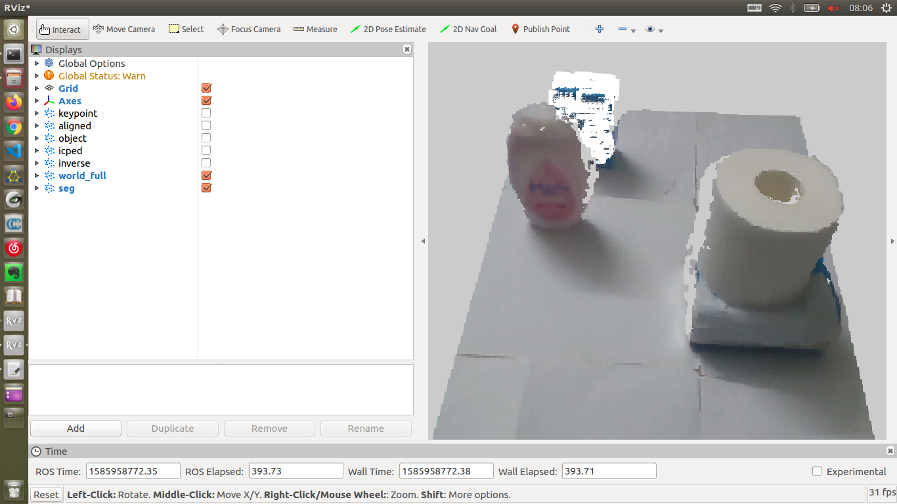
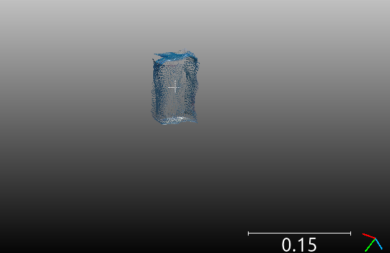
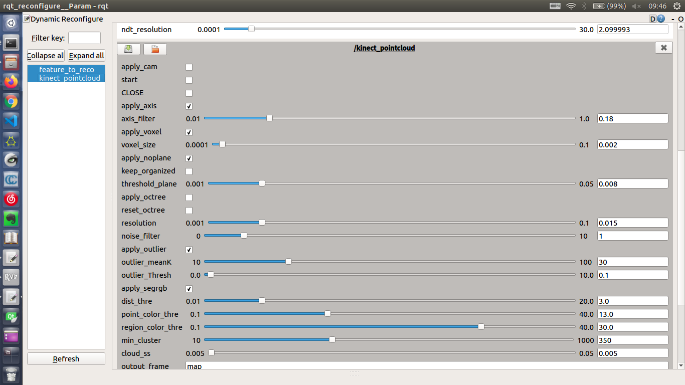
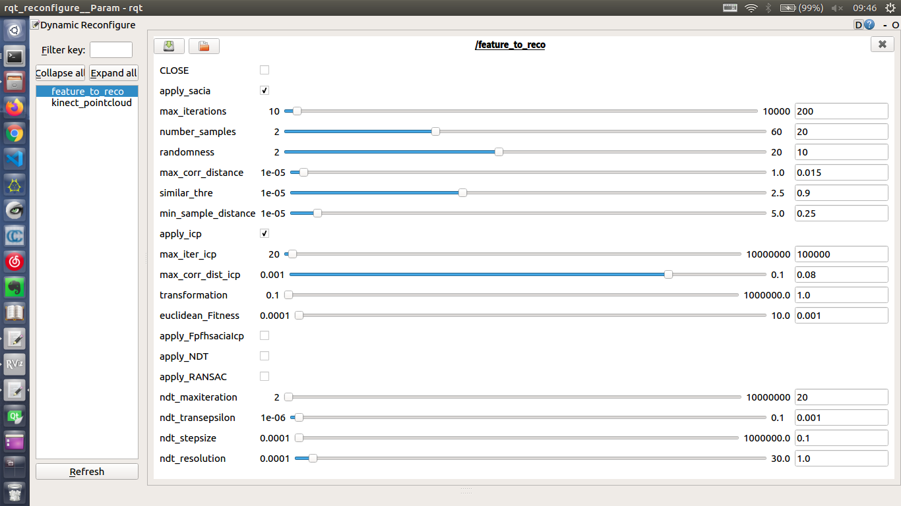
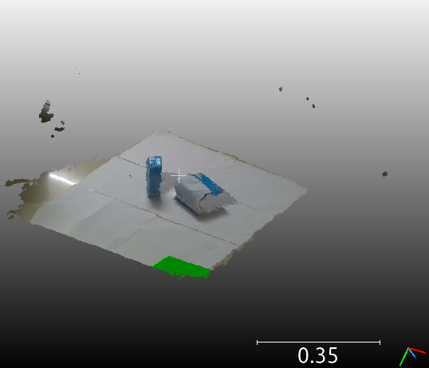
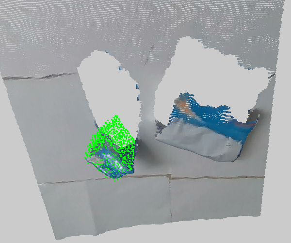

# Object Recognition implement with ROS and [PCL](https://pointcloudlibrary.github.io/documentation/)

## Basic information

**This is a modified version of**  [kalectro  **object_recognition.**](https://github.com/kalectro/object_recognition)

The original version contains basic frame of ROS interface and recognition functions.

before modifying including :

> find a known object inside a pointcloud using PCL and ROS groovy
Up to this point this package computes and supports two different SHOT descriptors.

> SHOT352 -> describes the shape around a keypoint
SHOT1344 -> describes the shape and the color distribution around a keypoint.

> Detection was test using real pointclouds.
The package is subdivided into different ROS nodes and can be replaced easyly. 


##  This repository extend the following features:

* **RealSense kinect V2  RGBD device starting and configuring.**

* **Add various segmentation methods (including RegionGrowingRGB and SAC for plane segmentation/removing)**
* **PCD /processed models file saving for debugging and obtaining models.(mainly in [./obj](./object_recognition/obj))**

* **Implement more feature descriptors for recognition (FPFH and more)<need debug>**

* **Different recognition strategies (performance varies)**

   Sample ConsensusInitial Alignment

  Iterative Closest Point

  Sample Consensus Prerejective

  Fpfh sacia Icp

  NDT Registration

  Geometric Consistency Grouping

* **VisuaRVIZlization of all mid-process pointclouds and results in RVIZ.**

* **detailed dynamic_reconfigure in ROS for debug.**

## Steps 

* **step 1**

  Get ready for the coding environment :(at least)

```
Linux (Ubuntu)
cmake (VERSION 2.8.3)
PCL (1.6.1)
realsense2 (2)
ROS (Kinetic)
```

* **step 2**

  There are two src files to compile:

```
src/feature_to_reco.cpp
src/pcd_to_pointcloud.cpp
```

* **step 3**

  Connect RealSense camera.

  Launch two .launch files to start the roscore \ rviz \ reconfigure terminals.

```
roslaunch object_recognition reco.launch 
roslaunch object_recognition ob_recognition.launch 

```

* **step 4**

  Tick to receive frames from camera for processing and displaying.


* **step 5**

  Here recorded the thought and improvement for a better recognition result.

  However, most of them failed.

  Will keep going.

  

## Result till now

This is the Rviz terminal and reconstruct model using other PointCloud software.

<div align="center"> </div>


The following image shows the most impressing performance. However,this is not robust enough for actual implement. The performance greatly relies on  the parameter of the functions, which is the following work to be done.

<div align="center"> 
    </div>

<div align="center"> 
    </div>

## Extended File

* [description_cn.pdf](./description_cn.pdf)  is a detailed description in Chinese of the pointcloud process about this project.
* [todo.txt](./todo.txt)  is the timeline about the thought and hints of what I have done in iterations.
* [object_recognition/obj](./object_recognition/obj) contains 8 models of common things. There are about 30 world frames too.


## **Notes**

There are some models and scene in ./obj directory, you can use it for debugging. (PCD format)

If there is any question about this project, please send me a message for discussion.

**keep learning!!**


